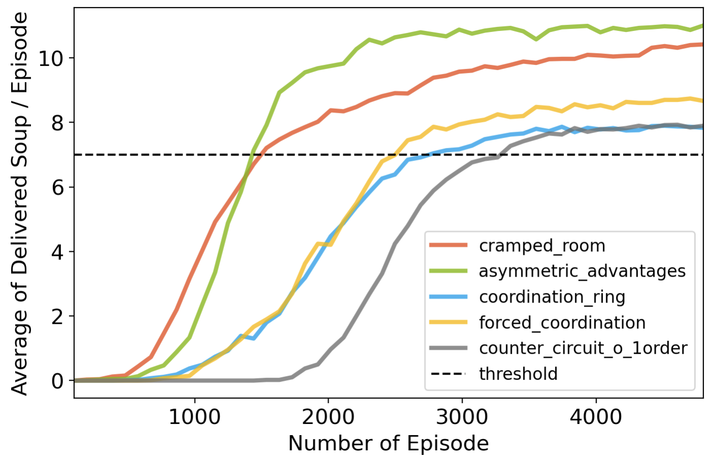
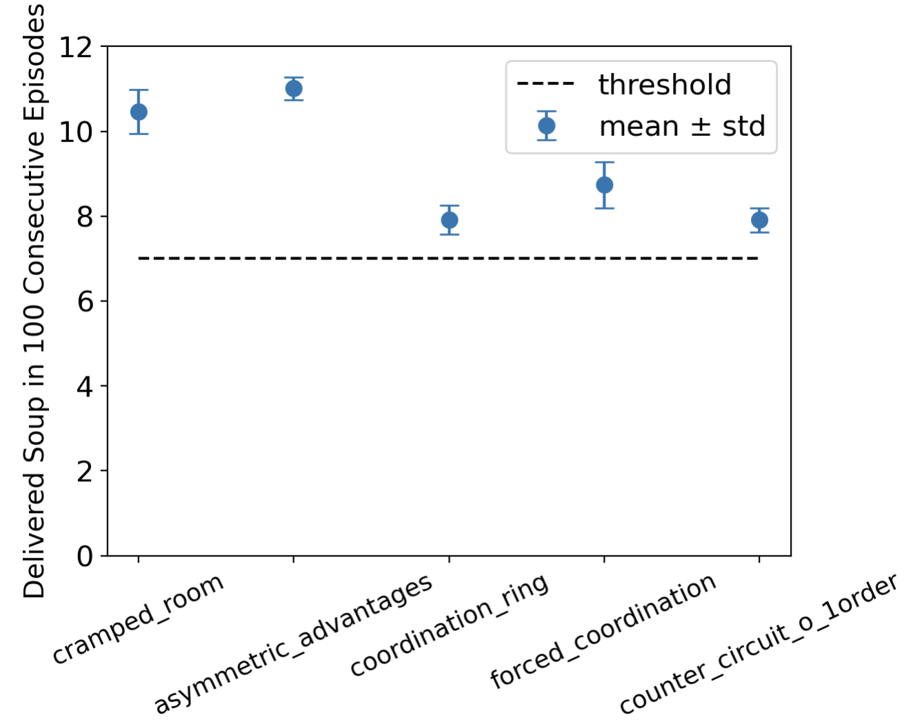
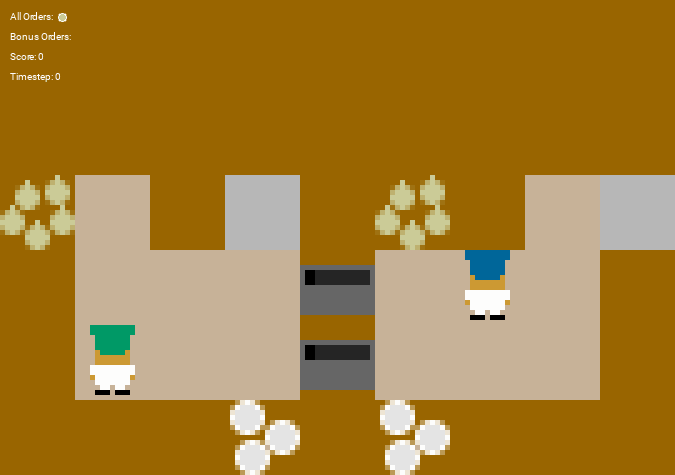
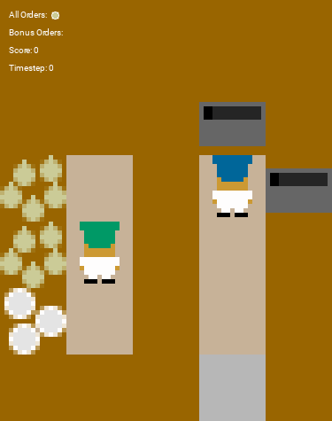

# Project Overview
In the multi-agent [Overcooked environment](https://github.com/HumanCompatibleAI/overcooked_ai), two chefs must collaborate in a restaurant to cook onion soups. The objective is to develop a reinforcement learning method that maximizes the number of soups delivered within an episode across various layouts. I found this problem particularly interesting and challenging, as traditional reinforcement learning approaches like Q-Learning and policy gradient are not well-suited for multi-agent environments. Consequently, I chose this project as a weekend endeavor to broaden my understanding of reinforcement learning. To address this challenge, I proposed using Multi-Agent Proximal Policy Optimization (MAPPO), which involves centralized training and decentralized execution techniques. Additionally, I implemented reward shaping and multiprocessing to enhance exploration efficiency. This approach proved highly effective in the Overcooked game, as demonstrated by the implementation details available in my [Github repository](https://github.com/JiaweiZhan/MAPPO_OvercookedGame).

# Theory
## Core: Proximal Policy Optimization
[Proximal Policy Optimization (PPO)](https://arxiv.org/abs/1707.06347) is trying to solve a question: how can we take the biggest possible improvement step on a policy without stepping so far from the old, using the data that are currently available. This's achieved by clipping in the objective function to prevent the new policy to get far from the old policy. Specifically, PPO update polices via


\begin{equation}
  \theta_{k + 1}=\mathrm{argmax}_{\theta}E_{s, a\sim\pi_{\theta_k}}[L(s, a, \theta_k, \theta)],
\end{equation}


by taking multiple steps of gradient decent. Here $L$ is given by:


\begin{equation}
\begin{split}
L(s, a, \theta_k, \theta) = \mathrm{min}\begin{cases}\frac{\pi_{\theta}(a|s)}{\pi_{\theta_k}(a|s)}A^{\pi_{\theta_{k}}}(s, a), \\
\mathrm{clip}\left(\frac{\pi_{\theta}(a|s)}{\pi_{\theta_k}(a|s)}, 1-\epsilon, 1+\epsilon\right)A^{\pi_{\theta_{k}}}(s, a).\end{cases}
\end{split}
\end{equation}


where hyperparameter $\epsilon$ controls how far away the new policy is allowed to go from the old. The advantage function $A^{\pi_{\theta}}(s, a)$ is approximated via [Generalized Advantage Estimation](https://arxiv.org/abs/1506.02438?source=post_page---------------------------):
\begin{equation}
  A_t^{\mathrm{GAE}(\gamma, \lambda)} = \sum_{l=0}^{\infty}(\gamma\lambda)^{l}\left(r_{t+l} + \gamma V^{\pi, \gamma}(s_{t + l + 1}) - V^{\pi, \gamma}(s_{t + l})\right).
\end{equation}
Within the advantage function is the value function $V^{\pi, \gamma}(s_t)$ approximated by another model, which is fitted by regression on mean-squared error:


\begin{equation}
  \psi = \mathrm{argmin}_{\phi}||V_{\psi}^{\pi, \gamma}(s_t) - \sum_{l=0}^{\infty}\gamma^{l}r_{t + l}||^2,
\end{equation}


through gradient descent algorithm.

## Centralizing Training and Decentralizing Execution
The overcooked game is a cooperative, multi-agent games that may be challenging for traditional reinforcement learning approaches such as Q-Learning or policy gradien. Here, I decided to adopt [centralizing training and decentralizing execution technics](https://arxiv.org/abs/1706.02275) to achieve cooperation amoung multiple-agent in the game. More concretely, for a game with N agents with policies $\Pi=\{\pi_1, ..., \pi_N\}$ parameterized by $\Theta=\{\theta_1, ..., \theta_N\}$. The gradient of expected return $J(\theta_i)=E[R_{i}]$ for agent $i$ is:


\begin{equation}
  \nabla_{\theta_{i}}J(\theta_i)=E_{o_i, a_i\sim\pi_i}[\nabla_{\theta_i}\mathrm{log}\pi_i(a_i|o_i)A_{i}^{\Pi}:(\mathbf{x}, a1, a2, ..., a_N)],
\end{equation}


where $o_i$ is the local observation of agent $i$, and $\mathbf{x}$ is the global state of the game,  including all agents' features $\mathbf{\\{[player\ i\ features, player\ i\ position]\\}}$. In other word, during the training procedure, the advantage function is approximated given the full information of the game and agents' strategies are evolved based on that. Hopefully, agents can learn to coorperate and make decisions based on their local observation.

# Implementation Details
The backbone PPO follows the implementation in the original [PPO paper](https://arxiv.org/abs/1707.06347), utilizing a 4-layer policy model with 96, 64, 64, and 6 neurons, and a separate 4-layer value function with 48, 64, 64, and 1 neurons. This section discusses additional implementation aspects, including centralized training and decentralized execution, and outlines strategies to tackle challenges associated with sparse rewards and time-intensive online data collection.

## Shared Policy Model and Symmetric Value Function
The idea of shared policy is motivated by the pursuit of AGI in the whold AI field as well as the intuition of 'I should be able to know what to do if I'm in his position.' In that case, both agent in the Overcooked game will share a single policy game. And two agents are trying to optimized the unified strategy together:

\begin{equation}
  \theta_{k+1} = \mathrm{argmax}_{\theta}E_{i}\left[E_{s_i, a_i\sim\pi_{\theta_k}}[L(o_i, a_i, \theta_k, \theta)]\right]
\end{equation},

where $i$ is the agents' index.

Additionally, the centralized value function should be invarient to the switch of two agents, since the agents should be indistinguishable and the global state should only depends on where the agents are located in as well what they are doing, instead who is doing that. Motivated by this the invarient value function can be expressed by:

\begin{equation}
  V_{\psi}(\mathbf{x}) = \mathbf{O}\{f_{\psi}(o_i)\},
\end{equation}

where $\mathbf{O}$ can be any invarient operator, such as mean and plus. In my implementation, I choose to use plus operator.

## Reward Shaping
In the default setting, agents receive rewards only if they successfully deliver onion soup, which requires a sequence of actions including placing onions in a pot and picking up the soup. To promote efficient learning of these prerequisites for soup-making, rewarding intermediate achievements could be beneficial. This strategy helps overcome the challenge of sparse rewards throughout the game, potentially leading to highly inefficient exploration processes. The reward formula I employ is: $ r = 20 \times$ soup delivery$ + 3 \times$ PLACEMENT IN POT REWARD $+ 3 \times $DISH PICKUP REWARD$ + 5 \times $SOUP PICKUP REWARD. The coefficients in this formula represent the cumulative score all agents receive when one successfully completes an action. Due to the centralized training techniques I use, the rewards are shared among all agents.

## Efficient Exploration with Parallel Multiple Walkers
The exploration process significantly impacts the efficiency of learning in RL model training and can be time-consuming. To enhance efficiency, I have set up multiple independent environments allowing parallel exploration by creating several processes, each hosting an independent environment. These processes share the same policy model and value function. Gradients of weights are computed in parallel, then averaged and synchronized across processes. This setup enables all agents to explore the environments and collect data using the same strategy and value function.

# Result
By combining all technics mentioned above, I'm able to train MAPPO to deliver more than 7 onion soups for all 5 layouts in 400 step horizon. Fig.[train_eval](#pookie) shows the number of soups delivered per episode during the training procedure(a), as well as the reliability of trained model by plotting the mean and variance of occurance of delivering soup for 100 consecutive episodes(b). More than that, thanks to the parallel multi-walker exploration strategy enabled by multi-processing with 32 CPUs, the RL model can be trained within 5 minutes per layout.

  
  

# Demo
- ***asymmetric advantages layout***

- ***forced coordination layout***

# Discussion
I showed that MAPPO with centralizing training and decentralizing execution strategy achieves surprising effectiveness in cooperative, multi-agent Overcooked game. I also demonstrated the importance of reward structures in improving learning efficiency. Here are some additional explorations that I could possibly do in the future:
  * Utilizing RNN for the policy and value functions.
  * Robustness and adversarial testing.
